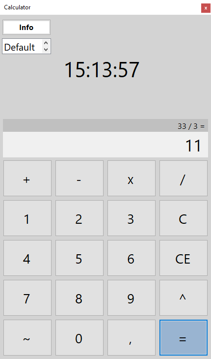
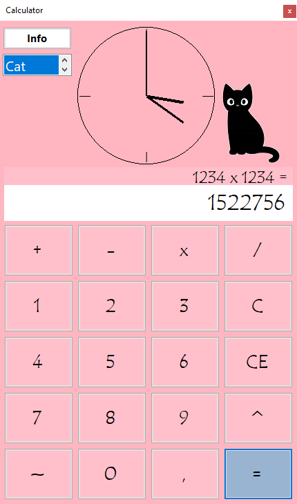

# Project Name
Simple calculator

## Description
The application is a calculator with an integrated clock function. It supports basic mathematical operations, including addition, subtraction, multiplication, division, and multiplication of opposite numbers. Users can input floating-point numbers and negative values. If an error is made, the user has the option to delete the last entered character or to clear the entire calculator screen.

The application also displays the current time, offering both digital and analog clock options. Users can interact with the calculator using either the mouse or keyboard. A dedicated button within the application reveals additional tips on how to effectively utilize it.

Throughout its operation, users can access a list to customize the appearance of the application. This high level of configurability includes choosing between a digital or analog display for the time, and selecting from one of three predefined appearance sets or creating a "custom" look by choosing the calculator's color scheme and the font family used throughout the application.

## Interface Description

Clicking the "Info" button opens a window containing tips for using the application. Below is a list from which you can select to change the appearance of the calculator to one of the following options:

Default: The appearance that is loaded when the application is launched.
Digital: Changes the font, button colors, label colors, and background. Includes a PictureBox featuring a duckling image that displays a message when pressed.
Cat: Alters the font, button colors, label colors, and background. Features a PictureBox with a cat image that displays a message when pressed.
Custom: Selecting this option triggers the display of the ColorDialog window, where the selected color is used for the buttons and background. Afterwards, the FontDialog is displayed to choose a font family, which is then applied throughout the program.
A single click on the clock toggles it between analog and digital styles.

|  |  |
|:-----------------------:|:-----------------------:|
| Default skin         | Cat theme skin          |

### Coding Environment
The program is written in C# .NET Framework 6.0 in the Visual Studio 2022 environment.

### Author 
Jakub Redmerski